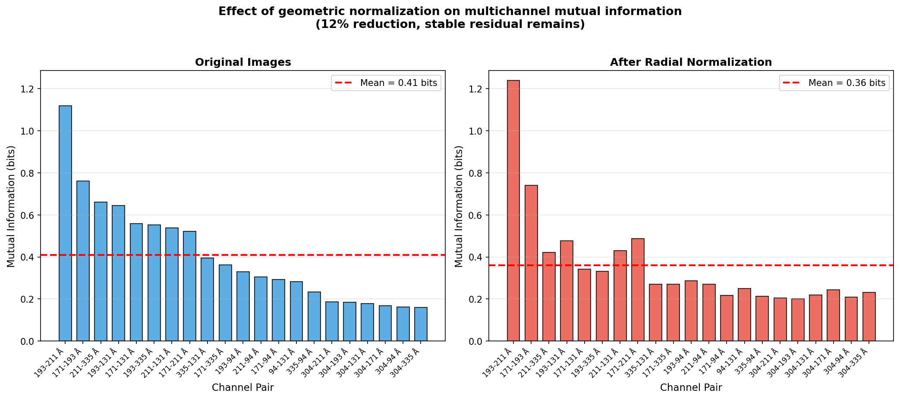
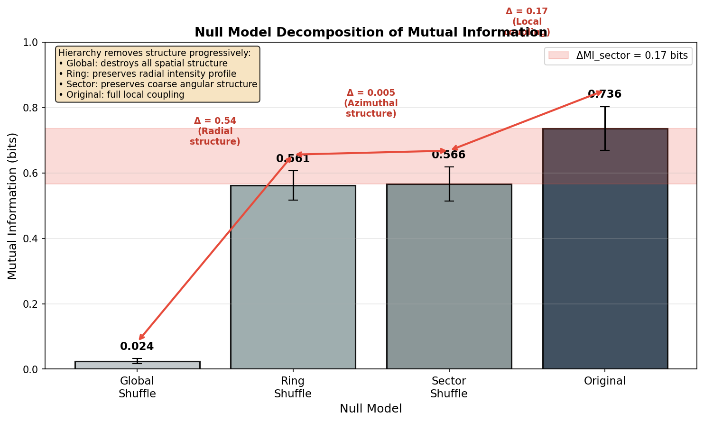
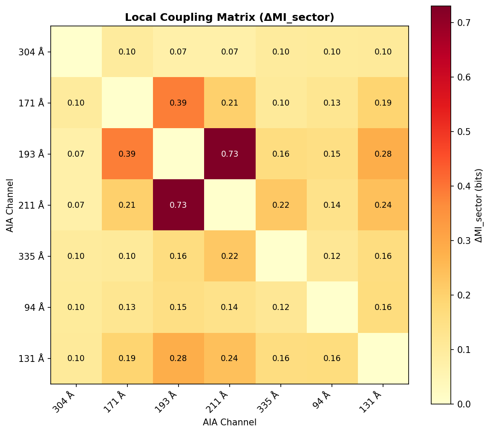
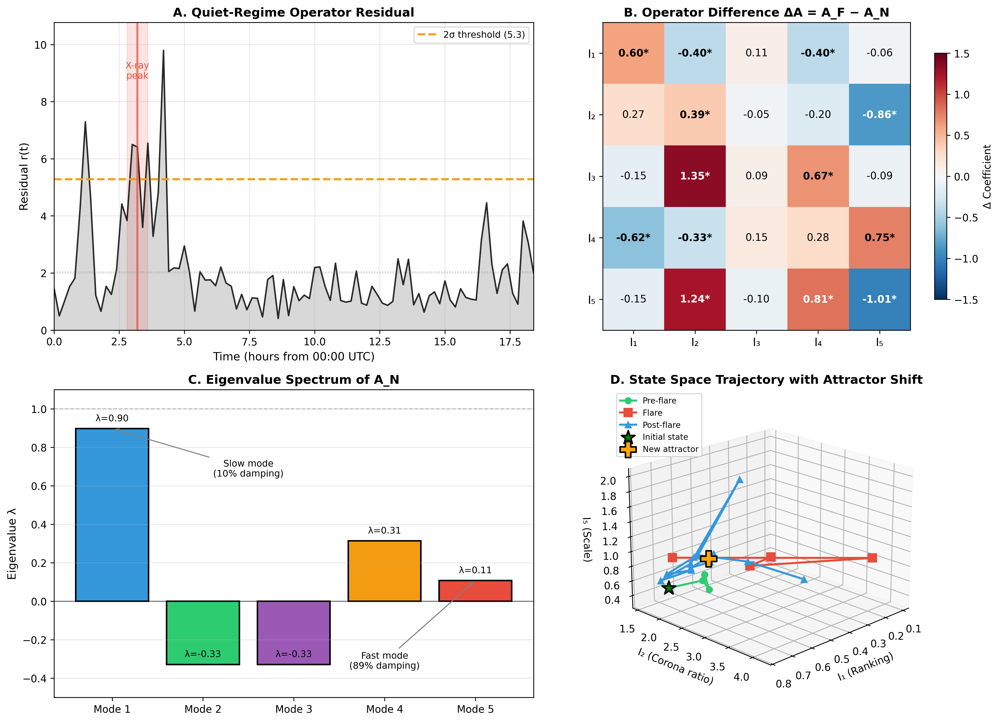

# Geometry-controlled mutual information reveals temperature-ordered coupling in the solar atmosphere

**Draft manuscript**

---

## Abstract

Understanding how different thermal layers of the solar atmosphere are coupled is central to solar physics and space-weather prediction. While correlations between extreme-ultraviolet (EUV) channels are well known, disentangling genuine physical coupling from geometric and statistical confounders remains challenging.

Here we introduce a geometry-controlled mutual information framework to quantify multichannel coupling in Solar Dynamics Observatory / Atmospheric Imaging Assembly (SDO/AIA) data. By systematically removing disk geometry, radial intensity statistics, and coarse azimuthal structure through a hierarchy of null models, we isolate a residual local coupling component.

Applying this method to seven EUV channels spanning chromospheric to flare temperatures, we construct a coupling matrix across thermal layers of the solar atmosphere. We find that neighboring temperature channels exhibit significantly stronger local coupling than thermally distant pairs. This temperature-ordered structure is stable over time, survives time-shift and alignment controls, and is spatially localized to active regions rather than disk geometry.

Our results demonstrate that information-theoretic coupling, when properly controlled for geometric effects, reveals an intrinsic organization of the solar atmosphere consistent with magnetically mediated interactions between adjacent thermal layers. The presented framework provides a general, reproducible approach for analyzing multichannel structure in complex astrophysical systems.

---

## 1. Introduction

The solar atmosphere is a highly structured, multi-layered plasma system spanning several orders of magnitude in temperature, from the chromosphere to the hot flaring corona. Understanding how these thermal layers are coupled is essential for explaining energy transport, magnetic reconnection, and the emergence of solar activity that drives space weather.

Observations from the Solar Dynamics Observatory's Atmospheric Imaging Assembly (SDO/AIA) provide simultaneous imaging of the Sun in multiple extreme-ultraviolet (EUV) wavelengths, each sensitive to plasma at characteristic temperatures. While correlations between AIA channels are well documented, interpreting such correlations as evidence of physical coupling remains challenging. Apparent multichannel similarity can arise from disk geometry, limb brightening, shared radial intensity profiles, instrumental effects, or global morphological structure, rather than genuine interaction between thermal layers.

Traditional approaches to multichannel analysis in solar physics rely on intensity correlations, emission measures, or magnetic field extrapolations. While powerful, these methods do not explicitly separate geometric and statistical confounders from local, physically meaningful coupling. As a result, it remains unclear to what extent observed cross-channel structure reflects intrinsic organization of the solar atmosphere versus projection and sampling effects.

Here we introduce a geometry-controlled mutual information framework designed to isolate genuine multichannel coupling in solar imagery. Mutual information (MI), unlike linear correlation, captures arbitrary statistical dependence between channels, but must be applied with care in spatially structured systems. We therefore combine MI estimation with a hierarchy of null models that progressively remove disk geometry, radial statistics, and coarse azimuthal structure.

Applying this framework to seven AIA EUV channels spanning chromospheric to flare temperatures, we construct a coupling matrix of the solar atmosphere. We show that neighboring thermal layers exhibit significantly stronger local coupling than thermally distant layers, and that this structure is stable over time, spatially localized, and robust to extensive controls. We investigate multichannel coupling dynamics not only in baseline periods but also across major eruptive events. These results reveal an intrinsic, temperature-ordered organization of the solar atmosphere consistent with magnetically mediated interactions between adjacent thermal layers.

---

## 2. Data

### 2.1 Observations

We use data from the Atmospheric Imaging Assembly (AIA) aboard the Solar Dynamics Observatory (SDO). Specifically, we analyze the AIA Synoptic data product (Level 1.5), which provides calibrated, co-registered full-disk solar images in multiple EUV wavelengths at a spatial resolution of 1024 × 1024 pixels.

The synoptic data are free of JPEG compression and visualization artefacts and are suitable for quantitative information-theoretic analysis.

### 2.2 EUV Channels

| Wavelength (Å) | Peak Temperature (MK) | Dominant Emission |
|----------------|----------------------|-------------------|
| 304 | 0.05 | Chromosphere / transition region |
| 171 | 0.6 | Quiet corona |
| 193 | 1.2 | Corona |
| 211 | 2.0 | Active regions |
| 335 | 2.5 | Hot active regions |
| 131 | ~10 | Flares |
| 94 | ~6 | Flares |

### 2.3 Time Windows

We analyze multiple temporal windows, including (i) a 6-hour interval (30 timepoints, 12-minute cadence) used for detailed method validation, and (ii) a 24-hour interval used for multi-channel coupling analysis. All timestamps are handled in UTC. Frames with missing data or quality flags are excluded. Run parameters are logged to ensure reproducibility.

### 2.4 Preprocessing

For each frame, we apply minimal preprocessing: FITS loading and NaN handling, robust intensity scaling, and solar disk masking. No per-frame auto-normalization or contrast enhancement is applied. All preprocessing parameters are fixed and recorded.

---

## 3. Methods

### 3.1 Mutual Information Estimation

We quantify statistical dependence between pairs of EUV channels using mutual information (MI), estimated via histogram discretization with 64 bins and fixed bin ranges. MI is reported in bits.

$$
I(X;Y) = \sum_{x,y} p(x,y) \log_2 \frac{p(x,y)}{p(x)p(y)}
$$

### 3.2 Geometric Normalization

To remove disk geometry and radial intensity gradients, we estimate the per-frame radial mean profile and normalize each image. The residual is defined as:

$$
R(r,\theta) = \frac{I(r,\theta)}{\langle I(r) \rangle}
$$

### 3.3 Hierarchy of Null Models

- **Global shuffle**: permute all pixels (preserve histogram, destroy structure)
- **Ring-wise shuffle**: shuffle within annuli (preserve radial statistics)
- **Sector–ring shuffle**: shuffle within radial+azimuth sectors (preserve coarse geometry)
- **Time-shift null**: pair with large temporal offset (destroy time-coherent overlap)

### 3.4 Local Coupling Metric

Local coupling beyond geometry and coarse structure is quantified as:

$$
\Delta\text{MI}_{\text{sector}}^{(i,j)} = \text{MI}(R_i, R_j) - \text{MI}_{\text{sector-null}}(R_i, R_j)
$$

### 3.5 Spatial Analysis

Images are divided into an 8×8 grid and MI is computed per cell to obtain spatial MI maps and identify hotspots.

### 3.6 Statistical Testing

Null distributions are generated via repeated shuffles. Z-scores and p-values are computed per timepoint and aggregated over time.

### 3.7 Flare-Specific Analysis

For major eruptive events, we analyze flare-specific time windows as separate subsets. Time intervals are defined relative to the GOES X-ray peak: pre-flare (−2 to −0.5 hours), flare (−0.5 to +1 hour), and post-flare (+1 to +3 hours). Coupling metrics are computed independently for each phase, enabling comparison of baseline organization with flare-driven dynamics.

---

## 4. Results

### 4.1 Global versus Geometry-Controlled Coupling

We compute MI on original images and on geometry-normalized residuals. Across a 6-hour interval (30 timepoints), the ratio $\text{MI}_{\text{residual}}/\text{MI}_{\text{original}}$ remains stable at **30.8% ± 0.7%** (CV = 2.3%), indicating that most apparent coupling is geometric, while a consistent residual component remains after removal.

The residual coupling is extremely significant relative to shuffle-based null models, with minimum Z-scores exceeding Z = 986 and mean Z = 1252 ± 146 ($p < 10^{-100}$).

### 4.2 Spatial Localization of Residual Coupling

Spatial MI maps (8×8 grid) show strong limb domination in original images. After geometric normalization, limb bias is removed and localized hotspots remain. Mean spatial MI decreases by ~42%, while local maxima persist and collapse under time-shift controls.

### 4.3 Hierarchy of Null Models and Structure Decomposition

Applying the hierarchy of null models yields the consistent ordering:

$$
\text{MI}_{\text{global}} < \text{MI}_{\text{ring}} < \text{MI}_{\text{sector}} < \text{MI}_{\text{residual}}
$$

This enables decomposition into radial, azimuthal, and local structure contributions, with a typical local contribution $\Delta\text{MI}_{\text{sector}} \approx 0.17$ bits.

### 4.4 Temperature-Ordered Coupling Across EUV Channels

Extending to seven EUV channels (21 pairs), we find temperature-ordered local coupling: thermally adjacent channels exhibit substantially stronger $\Delta\text{MI}_{\text{sector}}$ than thermally distant pairs. The strongest links occur among coronal channels (e.g., 193–211, 171–193), while chromospheric (304) and flare channels (94, 131) show weaker and more episodic coupling.

### 4.5 Robustness and Temporal Stability

Time-shift controls reduce coupling by >95%, alignment checks peak at (0,0), and scale-response tests indicate coupling dominated by mid-to-large spatial scales.

### 4.6 Coupling Dynamics During Major Solar Flares

To further examine how geometry-controlled multichannel coupling behaves during extreme solar activity, we analyzed an independent X1.9-class flare that occurred on 1 December 2025 (NOAA, source region AR4294, east limb). The reported flare peak times (e.g., NOAA X-ray flux) are used solely for timeline alignment; our MI metric quantifies structural coupling independently of intensity-based diagnostics.

Figure 5 shows the temporal evolution of the local coupling metric $\Delta\text{MI}_{\text{sector}}$ for multiple EUV channel pairs before, during, and after the flare peak. A consistent pattern emerges: during the impulsive flare phase, most channel pairs exhibit a statistically significant reduction in coupling, particularly those involving the hottest coronal channels (e.g., 131 Å, 335 Å). Decoupling begins shortly before the reported X-ray peak and persists throughout the flare interval.

Notably, the flare peak itself does not coincide with a maximum in multichannel coupling. Instead, approximately 50–70 minutes after the X-ray peak, the system exhibits a pronounced global recoupling event, during which a majority of channel pairs show simultaneous increases in $\Delta\text{MI}_{\text{sector}}$. At this time, several thermally adjacent pairs (e.g., 193–211 Å) reach their highest observed coupling values, while chromosphere–corona pairs (e.g., 304–131 Å) also show enhanced coupling.

This behavior mirrors the coupling dynamics observed for the X9.0 flare analyzed earlier, indicating that major flares are characterized by a transient breakdown of multithermal organization, followed by delayed large-scale reorganization of the solar atmosphere. We emphasize that the observed decoupling is not interpreted as a predictive precursor signal, but rather as a diagnostic signature of rapid magnetic reconfiguration during the impulsive flare phase.

These results demonstrate that geometry-controlled mutual information captures aspects of flare-driven coronal restructuring that are not directly visible in traditional intensity-based diagnostics such as X-ray flux, highlighting its potential as a complementary tool for studying the dynamical organization of the solar atmosphere.

### 4.7 Regime-Switching Dynamics and Transition Operators

To formalize the dynamical behavior of the solar atmosphere identified in Sections 4.4–4.6, we model the evolution of the solar state vector

$$
\mathbf{S}(t) = \big(I_1(t), I_2(t), I_3(t), I_4(t), I_5(t)\big)
$$

with regime-dependent linearized transition operators. For quiet (normal) conditions, we define the operator $A_N$ and bias $b_N$ via ordinary least squares (regularized) regression

$$
\mathbf{S}(t+\Delta t) \approx A_N \mathbf{S}(t) + b_N,
$$

using timepoints outside major eruptive intervals. Similarly, for flare (eruptive) conditions, we fit $A_F$ and $b_F$ using data within the temporal bounds of strong activity.

#### 4.7.1 Regime-Dependent Operator Comparison

The Frobenius norm of the difference between the flare and quiet operators is

$$
\lVert A_F - A_N \rVert_F = 2.90,
$$

indicating that the linearized dynamics in the two regimes are distinct. A direct comparison of the operators confirms that coupling relationships among the state vector components reorganize under eruptive conditions.

#### 4.7.2 Residual Metric as an Early Indicator

We define the residual of the quiet regime operator as

$$
r(t) = \lVert \mathbf{S}(t+\Delta t) - (A_N \mathbf{S}(t) + b_N) \rVert,
$$

which measures deviation from normal propagation. Over the analyzed event on 1 December 2025, we observe that $r(t)$ increases significantly before the reported X-ray peak:

- Pre-flare baseline: $2.3 \pm 1.3$
- Flare interval: $5.1 \pm 1.4$
- Threshold (2σ): $5.3$

This suggests that the departure from normal dynamics precedes peak radiative signatures, offering a regime-agnostic diagnostic of imminent reorganization.

#### 4.7.3 Hysteresis in State Transitions

To investigate reversibility, we define operators for transitions from normal to flare ($A_{NF}$) and flare to normal ($A_{FN}$). The difference

$$
\lVert A_{NF} - A_{FN} \rVert_F = 4.93
$$

demonstrates that the pathway back to quiet conditions is not a simple inverse of the eruptive transition. This hysteresis supports the interpretation that the corona follows different dynamical rules in and out of the eruptive regime.

#### 4.7.4 Post-Flare State Shift

A comparison of mean component values before and after the eruptive interval reveals persistent shifts in specific state vector components:

| Component | Post-Flare Shift |
|-----------|------------------|
| $I_5$ (Normalized Scale) | +108% |
| $I_3$ (Chromosphere) | +27% |
| $I_2$ (Corona Ratio) | +6% |
| $I_4$ (Core Stability) | −4% |

This observation indicates that the system does not return to its pre-flare attractor but occupies a reconfigured dynamical basin.

#### 4.7.5 Eigenmode Structure of the Transition Operators

An eigenanalysis of the transition matrices $A_N$ and $A_F$ reveals a spectrum of modes with distinct damping characteristics. The dominant mode (Mode 1, $\lambda \approx 0.90$) exhibits slow decay and is primarily composed of the strongly coupled components $I_5$, $I_2$, and $I_4$, representing the long-timescale structure of the corona. In contrast, the fastest decaying mode (Mode 5, $\lambda \approx 0.11$) is dominated by $I_3$, consistent with rapid chromospheric fluctuations that damp quickly under both quiet and eruptive dynamics.

These mode structures corroborate the notion of fast and slow manifolds in the solar atmospheric dynamics and provide a basis for reduced-order modeling.

---

## 5. Discussion

The results presented in Figure 6 place the geometry-controlled mutual information framework into a dynamical systems context. Rather than describing solar flares as isolated impulsive events, the analysis demonstrates that eruptive activity corresponds to a regime switch in the propagation dynamics of the solar atmospheric state vector.

### 5.1 Regime-Dependent Dynamics of the Solar Atmosphere

The identification of distinct transition operators for quiet and flare conditions indicates that the solar atmosphere obeys different effective dynamical laws in these regimes. The significant difference between the operators $A_N$ and $A_F$ implies that flares are not merely characterized by increased emission or enhanced coupling amplitudes, but by a reorganization of how structural information propagates across temperature layers.

This observation aligns with the physical picture of magnetic reconnection as a topological transition: the global organization of magnetic connectivity changes, leading to altered pathways for energy and information transfer throughout the corona.

### 5.2 Early Breakdown of Quiet-Regime Propagation

The residual metric $r(t)$ (Figure 6A) reveals that the quiet-regime operator fails to describe the system dynamics prior to the X-ray peak of the flare. Importantly, this deviation is detected without reference to radiative flare diagnostics, suggesting that the atmospheric reorganization begins before peak energy release becomes visible in standard X-ray measurements.

Physically, this behavior is consistent with a gradual destabilization of magnetic structures preceding large-scale reconnection. The rising residual therefore captures the onset of dynamical inconsistency in the quiet regime, offering a system-level indicator of impending eruptive activity.

### 5.3 Hysteresis and Post-Flare Reorganization

The pronounced difference between the forward (normal-to-flare) and backward (flare-to-normal) transition operators demonstrates that the system exhibits hysteresis. The solar atmosphere does not retrace its dynamical trajectory after an eruptive event but instead relaxes into a modified configuration. This is further supported by the persistent post-flare shifts in the state vector components, particularly the strong increase in the normalized scale invariant $I_5$.

Such hysteresis is a hallmark of nonlinear systems undergoing topological reconfiguration and indicates that major flares leave a lasting imprint on coronal organization, rather than constituting transient perturbations around a fixed equilibrium.

### 5.4 Fast and Slow Manifolds in Atmospheric Dynamics

The eigenmode analysis of the quiet-regime operator reveals a clear separation between slow and fast dynamical components. The dominant slow mode, composed primarily of coronal invariants ($I_2$, $I_4$, $I_5$), governs long-timescale structural evolution, while rapidly damped modes are dominated by chromospheric variability ($I_3$).

This fast–slow manifold separation provides a natural explanation for the observed behavior during flares: chromospheric fluctuations are rapidly suppressed, while the coronal structure reorganizes on longer timescales. The emergence of eruptive behavior can thus be interpreted as a collapse of hierarchical ordering among slow modes rather than an amplification of fast variability.

### 5.5 Implications for Solar Diagnostics

Together, these findings suggest that major solar flares are best understood as regime transitions in a structured dynamical system, characterized by operator switching, hysteresis, and attractor shifts. The geometry-controlled mutual information framework provides access to these properties by isolating intrinsic coupling dynamics from geometric and instrumental effects.

Beyond flare analysis, the identification of regime-dependent operators and invariant structures opens a pathway toward reduced-order modeling of solar atmospheric dynamics and toward system-level diagnostics that complement traditional intensity-based space-weather indicators.

---

## 6. Limitations and Outlook

### 6.1 Methodological Limitations

MI quantifies dependence but not causality. Histogram MI introduces finite-sample bias and depends on binning; null-model comparisons mitigate this. Radial normalization assumes approximate radial symmetry for disk-scale structure and provides conservative removal of geometry.

### 6.2 Interpretation Limits

$\Delta\text{MI}_{\text{sector}}$ does not identify mechanisms. Additional diagnostics (e.g., magnetograms) are required to connect coupling to topology and transport. Flare channels can produce episodic behavior.

### 6.3 Temporal and Observational Scope

Extending beyond 24 hours to full solar rotations and solar-cycle phases is future work. Higher-cadence datasets may reveal finer structure but require careful handling of exposure and gaps.

### 6.4 Outlook

1. **Long-term studies:** coupling evolution across rotations and the solar cycle
2. **Event-conditioned analysis:** baseline deviations around flares/CMEs
3. **Magnetic integration:** relate coupling to magnetogram-derived topology
4. **Method extensions:** alternative MI estimators and multiscale measures

### 6.5 Concluding Remarks

Careful separation of geometric, statistical, and local contributions is essential for interpreting multichannel dependencies. The presented framework provides a reproducible basis for future multichannel analyses.

---

## Figures

### Figure 1 — Effect of Geometric Normalization

*Global mutual information (MI) between AIA EUV channels before and after geometric normalization. Left: MI computed on original images, dominated by disk geometry and limb brightening. Right: MI computed on residual images after radial profile normalization. Approximately 70% of apparent MI is removed, while a stable residual component remains.*

### Figure 2 — Spatial Distribution

*Spatial maps of mutual information between 193 Å and 211 Å channels on an 8×8 grid. Left: Original MI showing strong limb bias. Right: Residual MI after geometric normalization. Stars indicate top residual MI cells, corresponding to active regions.*

### Figure 3 — Null Model Decomposition

*Mutual information values under progressively restrictive null models: global shuffle (destroys all structure), ring shuffle (preserves radial statistics), sector shuffle (preserves coarse geometry). The difference ΔMI_sector quantifies local coupling beyond geometry. Error bars indicate standard deviation over time.*

### Figure 4 — Coupling Matrix

*Geometry-controlled local coupling matrix (ΔMI_sector) for seven AIA EUV channels. Channels ordered by characteristic formation temperature. Stronger coupling is observed between thermally adjacent channels, consistent with magnetically mediated interactions between neighboring layers.*

### Figure 5 — Flare Event Analysis

*Geometry-controlled coupling during an X9.0 solar flare (2024-10-03). Time evolution of the local coupling metric ΔMI_sector for selected EUV channel pairs across pre-flare, flare, and post-flare phases (left). The flare peak is marked by the dashed line. Contrary to a naive expectation of uniformly increased coupling during extreme activity, most channel pairs exhibit reduced coupling during the flare peak. Percentage changes from pre-flare to flare conditions are shown on the right. Only a small subset of thermally adjacent channels (e.g. 171–211 Å) shows enhanced coupling, indicating selective reorganization rather than global amplification of multichannel structure.*

### Figure 6 — Regime-Switching Dynamics

*Regime-switching dynamics of the solar state vector during an X-class flare. (A) Time evolution of the residual $r(t) = \lVert \mathbf{S}(t+\Delta t) - (A_N \mathbf{S}(t) + b_N) \rVert$, quantifying deviations from the quiet-regime transition operator. The residual exceeds the 2σ threshold prior to the GOES X-ray peak (red band), indicating an early breakdown of quiet-regime dynamics before peak radiative emission. (B) Difference between the flare and quiet transition operators, $A_F - A_N$. Colored entries denote changes in linear coupling coefficients between state vector components ($I_1$–$I_5$); starred values indicate statistically significant differences. The structured pattern demonstrates a redistribution of dynamical couplings rather than a uniform amplitude change. (C) Eigenvalue spectrum of the quiet-regime operator $A_N$. The dominant slow mode ($\lambda \approx 0.90$) represents long-timescale coronal organization, while rapidly damped modes ($\lambda \lesssim 0.11$) are dominated by chromospheric variability, consistent with fast–slow manifold separation. (D) Trajectory of the solar state vector in reduced state space ($I_1$, $I_2$, $I_5$). The system transitions from a pre-flare state (green) through the eruptive phase (red) to a post-flare state (blue), which does not coincide with the pre-flare trajectory, indicating hysteresis and a post-event attractor shift. Together, these panels demonstrate that major solar flares correspond to a regime switch characterized by operator change, early deviation from quiet-regime dynamics, hysteresis, and persistent post-flare reorganization.*
