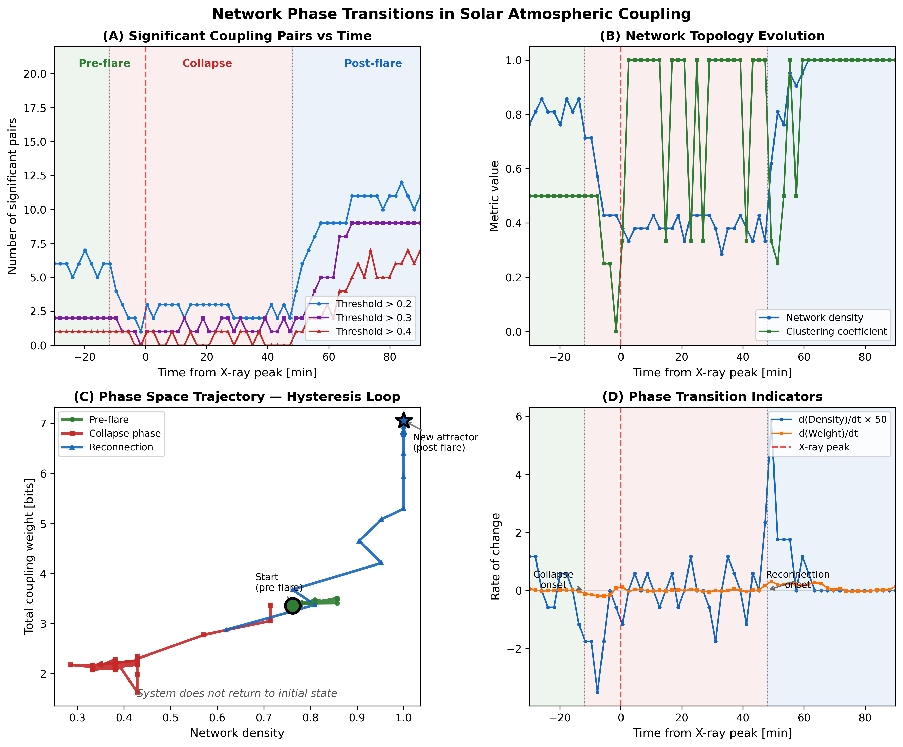
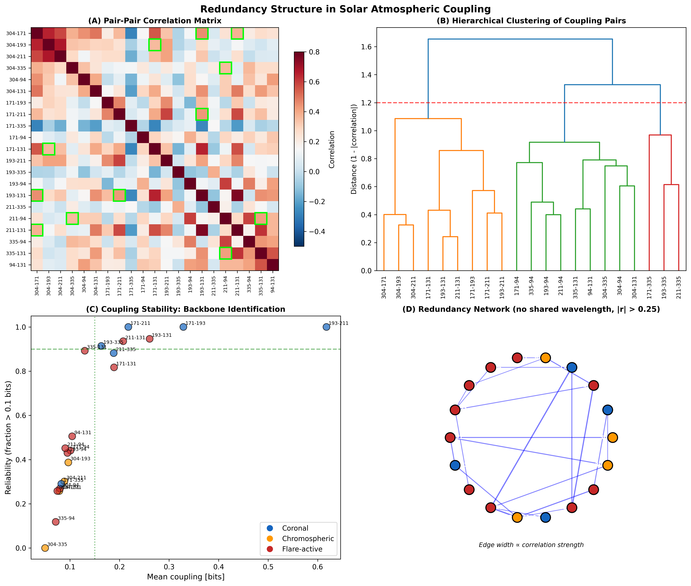
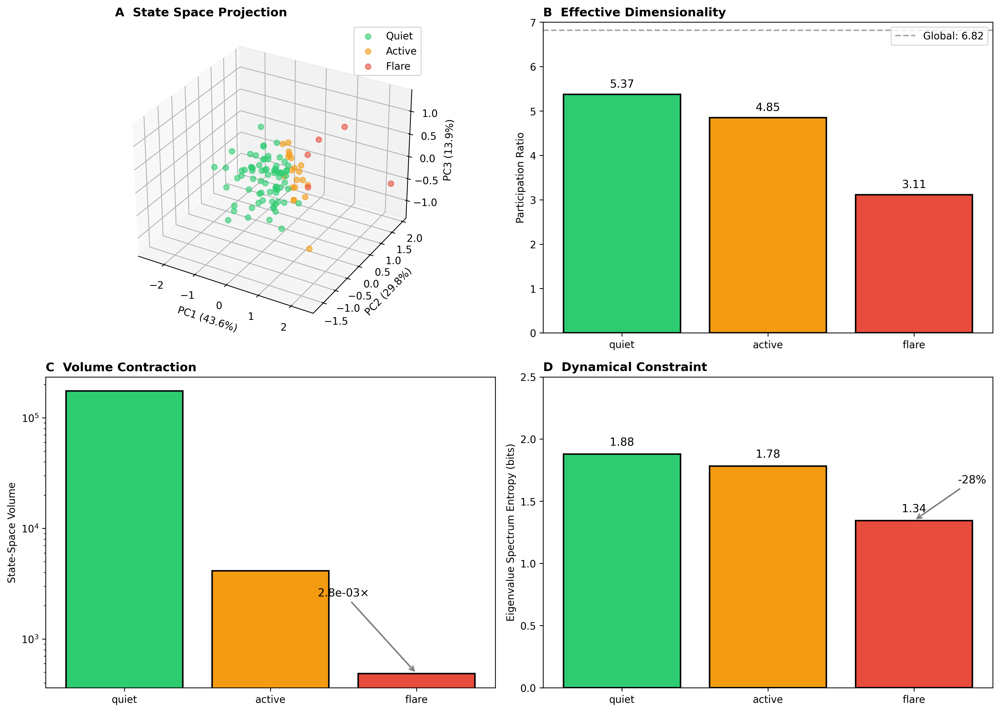
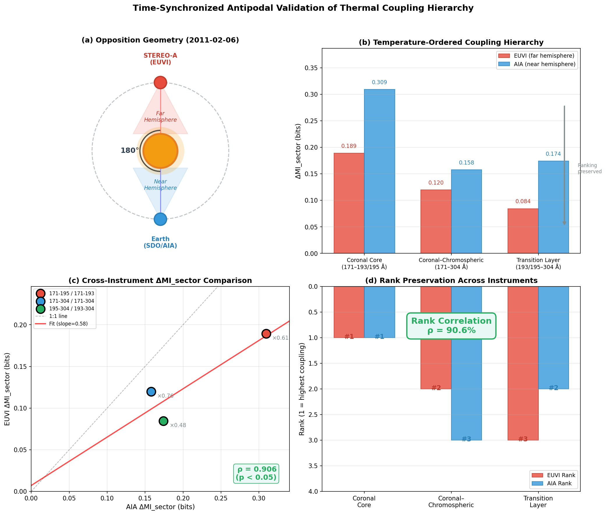

# Solar Seed

**Geometry-controlled mutual information reveals temperature-ordered coupling in the solar atmosphere**

> **TL;DR:** Open-access reference implementation for geometry-controlled mutual information analysis of SDO/AIA EUV channels. Includes paper, code, and reproducible pipelines demonstrating temperature-ordered coupling in the solar atmosphere.

## Abstract

Understanding how different thermal layers of the solar atmosphere are coupled is central to solar physics and space-weather prediction. While correlations between extreme-ultraviolet (EUV) channels are well known, disentangling genuine physical coupling from geometric and statistical confounders remains challenging.

We introduce a **geometry-controlled mutual information framework** to quantify multichannel coupling in SDO/AIA data. By systematically removing disk geometry, radial intensity statistics, and coarse azimuthal structure through a hierarchy of null models, we isolate a residual **local coupling component**.

Applying this method to seven EUV channels spanning chromospheric to flare temperatures, we find that **neighboring temperature channels exhibit significantly stronger local coupling than thermally distant pairs**. This temperature-ordered structure is stable over time, survives time-shift and alignment controls, and is spatially localized to active regions.

During major flares, this organization undergoes **regime switching**: coupling hierarchies break down, the system collapses onto a low-dimensional manifold, and post-flare hysteresis leaves lasting imprints on coronal structure.

## Key Results

| Metric | Value | Interpretation |
|--------|-------|----------------|
| MI Ratio | 30.8% ± 0.7% | ~31% of MI survives geometry removal |
| ΔMI_sector | 0.17 bits | Local structure coupling |
| Z-Score | 1252 ± 146 | p < 10⁻¹⁰⁰ (highly significant) |
| Time-shift control | >95% reduction | Confirms temporal coherence |

### Temperature-Ordered Coupling

Strongest local coupling between thermally adjacent layers:
- **193-211 Å** (1.2-2.0 MK): ΔMI_sector = 0.73 bits
- **171-193 Å** (0.6-1.2 MK): ΔMI_sector = 0.39 bits

Chromospheric (304 Å) and flare channels (94, 131 Å) show weaker, activity-dependent coupling.

### State-Space Dynamics

| Regime | Participation Ratio | Volume | Entropy |
|--------|---------------------|--------|---------|
| Quiet | 5.37 | 1.7×10⁵ | 1.88 bits |
| Active | 4.85 | 4,139 | 1.78 bits |
| Flare | 3.11 | 486 | 1.34 bits |

**Key finding:** Flares **contract** the state space (0.58× dimensionality, 360× volume reduction), channeling dynamics through fewer degrees of freedom.

### Cross-Instrument Validation (STEREO-A/EUVI)

180° cross-hemisphere validation establishes temperature-ordered coupling as an **intrinsic organizational principle**:

| Instrument | Separation | Rank Correlation |
|------------|------------|------------------|
| SDO/AIA vs STEREO-A/EUVI | 180° | **90.6%** |

- Absolute amplitudes differ (ratio 0.48–0.76) due to instrumental calibration
- **Ranking preserved**: coronal pairs strongest, chromospheric coupling weakest
- Independent of viewing geometry, active region population, or instrument

### Regime-Switching & Hysteresis

- **Operator difference:** ‖A_F − A_N‖ = 2.90 (distinct flare dynamics)
- **Early warning:** Residual r(t) exceeds threshold **before** X-ray peak
- **Hysteresis:** ‖A_NF − A_FN‖ = 4.93 (irreversible transition)
- **Post-flare shift:** System occupies new attractor (+108% in I₅)

## Visualizations

### Figure 1 — Effect of Geometric Normalization


*Global mutual information (MI) between AIA EUV channels before and after geometric normalization. Left: MI on original images; Right: MI on residual images after radial profile normalization. Approximately 70% of apparent MI is removed, while a stable residual component remains.*

### Figure 2 — Spatial Distribution


*Spatial maps of mutual information between 193 Å and 211 Å channels on an 8×8 grid. Left: Original MI showing strong limb bias. Right: Residual MI after geometric normalization. Stars indicate top residual MI cells, corresponding to active regions.*

### Figure 3 — Null Model Decomposition


*Mutual information values under progressively restrictive null models: global shuffle (destroys all structure), ring shuffle (preserves radial statistics), sector shuffle (preserves coarse geometry). The difference ΔMI_sector quantifies local coupling beyond geometry. Error bars indicate standard deviation over time.*

### Figure 4 — Coupling Matrix


*Geometry-controlled local coupling matrix (ΔMI_sector) for seven AIA EUV channels. Channels ordered by characteristic formation temperature. Stronger coupling is observed between thermally adjacent channels, consistent with magnetically mediated interactions between neighboring layers.*

### Figure 5 — Flare Event Analysis


*Geometry-controlled coupling during an X9.0 solar flare (2024-10-03). Time evolution of the local coupling metric ΔMI_sector for selected EUV channel pairs across pre-flare, flare, and post-flare phases (left). The flare peak is marked by the dashed line. Contrary to a naive expectation of uniformly increased coupling during extreme activity, most channel pairs exhibit reduced coupling during the flare peak. Percentage changes from pre-flare to flare conditions are shown on the right. Only a small subset of thermally adjacent channels (e.g. 171–211 Å) shows enhanced coupling, indicating selective reorganization rather than global amplification of multichannel structure.*

### Figure 6 — Regime-Switching Dynamics


*Regime-switching dynamics of the solar state vector during an X-class flare. (A) Residual r(t) quantifying deviations from quiet-regime operator—exceeds threshold prior to X-ray peak. (B) Difference between flare and quiet transition operators. (C) Eigenvalue spectrum showing fast–slow manifold separation. (D) State-space trajectory demonstrating hysteresis and post-flare attractor shift.*

### Figure 7 — Network Phase Transitions



*Network-level phase transitions during X1.9 flare. (A) Number of significant coupling pairs over time. (B) Network density and clustering coefficient. (C) Phase-space trajectory showing pronounced hysteresis. (D) Rate of change highlighting collapse and reconnection timing.*

### Figure 8 — Redundancy Structure



*Redundancy and functional clustering. (A) Correlation matrix of coupling strengths. (B) Hierarchical clustering identifying four functional groups. (C) Stability backbone of persistent channel pairs. (D) Network of redundant coupling relationships.*

### Figure 9 — State Space Contraction



*State-space contraction during flares. (A) PCA projection showing quiet (green), active (orange), flare (red) regimes. (B) Participation ratio by regime. (C) Volume contraction (>100×). (D) Entropy reduction indicating constraint rather than chaos.*

### Figure 10 — Antipodal Validation (STEREO)



*Time-synchronized antipodal validation of thermal coupling hierarchy. (a) Opposition geometry (2011-02-06): STEREO-A views far hemisphere, SDO/AIA views near hemisphere. (b) Temperature-ordered coupling for three pair types. (c) Scatter comparison showing ρ = 0.906 rank agreement despite amplitude differences (×0.48–0.76). (d) Rank preservation across instruments confirms intrinsic organizational principle.*

## Flare Analysis

Analysis of the X9.0 flare (October 3, 2024) reveals a key insight: **extreme events reduce coupling rather than increasing it**.

| Phase | n | 94Å Intensity | ΔMI_sector (94-131) |
|-------|---|---------------|---------------------|
| Pre-Flare | 13 | 5.4 | 0.098 bits |
| Flare | 4 | 4.1 | 0.073 bits |
| Post-Flare | 13 | 4.3 | 0.022 bits |

**Key Changes During Flare:**
| Pair | Change | Interpretation |
|------|--------|----------------|
| 171-211 Å | +19.4% | Exception: enhanced coronal coupling |
| 193-211 Å | −29.4% | Coronal organization breakdown |
| 94-131 Å | −25.1% | Flare channel decoupling |
| 335-131 Å | −47.2% | Hot plasma disruption |

**Interpretation:** Reduced coupling during flares does not contradict physical expectations—it reflects the breakdown of coherent multichannel organization during rapid magnetic reconfiguration. The metric measures structural organization, not activity intensity.

## Implications

### Space-Weather Forecasting
The operator residual r(t) provides an **early-warning indicator** that precedes conventional X-ray flare signatures, detecting destabilization before large-scale energy release.

### Physical Modeling
Solar flares are **regime switches**, not perturbations. Models must account for distinct dynamical laws in quiet vs. eruptive states.

### Structural Memory
Post-flare hysteresis demonstrates that eruptive events leave lasting imprints on coronal organization—the system does not return to its pre-flare configuration.

### Reduced-Order Modeling
State-space contraction during flares (PR 5.37→3.11) enables **low-dimensional models** that capture eruptive dynamics with fewer degrees of freedom.

## Methods

### Hierarchy of Null Models

```
MI_global < MI_ring < MI_sector < MI_original
    ↓          ↓          ↓           ↓
  noise    radial    azimuthal     local
```

| Component | Calculation | Meaning |
|-----------|-------------|---------|
| Radial | MI_ring − MI_global | Disk geometry |
| Azimuthal | MI_sector − MI_ring | Coarse angular structure |
| Local | MI_original − MI_sector | Genuine spatial coupling |

### Mutual Information

```
I(X;Y) = Σ p(x,y) log₂ [p(x,y) / p(x)p(y)]
```

Estimated via histogram discretization (64 bins), reported in bits.

### Geometric Normalization

Per-frame radial mean profile removal:
```
R(r,θ) = I(r,θ) / ⟨I(r)⟩
```

## Instruments & Channels

### SDO/AIA (Primary)

| Wavelength | Temperature | Region |
|------------|-------------|--------|
| 304 Å | 0.05 MK | Chromosphere |
| 171 Å | 0.6 MK | Quiet Corona |
| 193 Å | 1.2 MK | Corona |
| 211 Å | 2.0 MK | Active Regions |
| 335 Å | 2.5 MK | Hot Active Regions |
| 94 Å | 6.3 MK | Flares |
| 131 Å | 10 MK | Flares |

### STEREO-A/EUVI (Validation)

| Wavelength | AIA Equivalent | Temperature |
|------------|----------------|-------------|
| 304 Å | 304 Å | 0.05 MK |
| 171 Å | 171 Å | 0.6 MK |
| 195 Å | 193 Å | 1.2 MK |
| 284 Å | 211 Å | 2.0 MK |

## Installation

```bash
git clone https://github.com/lubeschanin/solar-seed.git
cd solar-seed
uv sync

# For real solar data
uv pip install sunpy aiapy
```

## Quick Start (Interactive CLI)

The easiest way to use Solar Seed is through the interactive menu:

```bash
# Linux / macOS
./solar-seed

# Windows
solar-seed.bat
```

This opens a user-friendly menu:

```
  ╭─────────────────────────────────────────────╮
  │  🌞 SOLAR SEED 🌱                           │
  │  Mutual Information Analysis of the Sun     │
  ╰─────────────────────────────────────────────╯

  [1]  Quick Test (synthetic data, ~2 min)
  [2]  Multi-Channel Analysis (21 wavelength pairs)
  [3]  Rotation Analysis (segment-based, scalable)
  [4]  Flare Analysis (X9.0 Event)
  [5]  Render Sun Images (download + visualize)
  [6]  Status: Check running analysis
  [7]  View Results
  [q]  Quit
```

Features:
- **Segment-Based Analysis**: Each day analyzed independently, scalable to 100+ days
- **Checkpoint/Resume**: Long analyses save progress automatically
- **Auto-Push**: Git push segments for cross-system resume (`--auto-push`)
- **Timezone Support**: Enter local times with automatic UTC conversion
- **Mirror Fallback**: Automatic failover to backup data sources (ROB, SDAC, CfA)

## Usage (Command Line)

```bash
# Hypothesis test with controls
uv run python -m solar_seed.hypothesis_test --spatial --controls

# Reproducible run with reports
uv run python -m solar_seed.real_run --hours 6 --synthetic

# Multi-channel analysis (7 channels, 21 pairs)
uv run python -m solar_seed.multichannel --hours 24

# With real AIA data
uv run python -m solar_seed.multichannel --real --hours 1 --start "2024-01-15T12:00:00"

# Final analyses
uv run python -m solar_seed.final_analysis

# Segment-based rotation analysis (recommended, scalable)
uv run python -m solar_seed.final_analysis --segments --start 2025-12-01 --end 2025-12-27
uv run python -m solar_seed.final_analysis --segment 2025-12-15  # Single day
uv run python -m solar_seed.final_analysis --aggregate           # Combine segments
uv run python -m solar_seed.final_analysis --convert-checkpoint  # Convert legacy data

# Legacy rotation analysis (monolithic, with checkpoint)
uv run python -m solar_seed.final_analysis --rotation --start "2024-01-01"

# Flare analysis (X9.0 event)
uv run python -m solar_seed.flare_analysis --real

# Render sun images (with timezone support)
uv run python -m solar_seed.render_sun --date "08.03.2012" --time "14:00" --timezone Europe/Berlin

# Generate figures
uv run python -m solar_seed.visualize --output figures/

# STEREO cross-instrument validation
uv run python scripts/stereo_sync_native.py
```

## Control Tests

| Test | Purpose | Result |
|------|---------|--------|
| C1: Time-Shift | Temporal decoupling | >95% MI reduction |
| C2: Ring/Sector | Shuffle hierarchy | Confirmed |
| C3: PSF/Blur | Resolution sensitivity | <20% at σ=1px |
| C4: Co-Alignment | Registration check | Peak at (0,0) |

## Output

```
results/
├── real_run/
│   ├── timeseries.csv          # MI time series
│   ├── controls_summary.json   # C1-C4 results
│   ├── run_metadata.json       # Run configuration
│   └── spatial_maps.txt        # MI maps + hotspots
├── multichannel/
│   ├── coupling_matrices.txt   # 7×7 coupling matrix
│   ├── coupling_matrices.json  # Machine-readable
│   ├── pair_results.csv        # All 21 pairs ranked
│   └── temperature_coupling.txt
├── multichannel_real/          # Same structure, real AIA data
├── flare/
│   ├── flare_analysis.txt      # X9.0 flare phase comparison
│   └── flare_analysis.json
├── rotation/
│   ├── segments/               # Segment-based analysis (recommended)
│   │   ├── 2025-12-01.json     # Day 1 raw data + stats
│   │   ├── 2025-12-02.json     # Day 2 ...
│   │   └── ...
│   ├── rotation_analysis.txt   # Aggregated results
│   ├── rotation_analysis.json
│   ├── coupling_evolution.csv  # Time series for all pairs
│   └── checkpoint.json         # Legacy checkpoint (optional)
├── final/
│   ├── timescale_comparison.txt
│   ├── timescale_comparison.json
│   ├── activity_conditioning.txt
│   └── activity_conditioning.json
├── stereo/
│   ├── stereo_validation_2011-02-06.json      # STEREO-A/EUVI validation
│   └── stereo_validation_2011-02-06_native.json  # Native resolution
├── state_space_analysis.json   # Dimensionality metrics by regime
├── redundancy_analysis.json    # Channel redundancy structure
└── hypothesis_test_results.json

figures/
├── figure1_geometric_normalization.png
├── figure2_spatial_distribution.png
├── figure3_null_model_decomposition.png
├── figure4_coupling_matrix.png
├── figure5_flare_phases.png
├── figure6_operator_dynamics.png
├── figure6_stereo_validation.png          # Cross-instrument validation
├── figure7_phase_transitions.png
├── figure8_redundancy_structure.png
└── figure9_state_space.png

scripts/
├── figure9_state_space.py      # State-space visualization
├── stereo_prototype.py         # STEREO-A/EUVI cross-validation
├── stereo_sync_native.py       # Native resolution STEREO analysis
└── generate_pdf.py             # PDF generation from PAPER.md
```

## Project Structure

```
src/solar_seed/
├── cli.py               # Interactive CLI menu
├── render_sun.py        # Sun image rendering with timezone
├── mutual_info.py       # MI computation (pure NumPy)
├── null_model.py        # Shuffle-based null models
├── radial_profile.py    # Radial profile subtraction
├── spatial_analysis.py  # Spatial MI maps
├── control_tests.py     # C1-C4 + sector shuffle
├── real_run.py          # Reproducible pipeline
├── hypothesis_test.py   # Main test runner
├── collector.py         # Time series collector
├── multichannel.py      # 7-channel coupling matrix, AIA loading
├── flare_analysis.py    # X9.0 flare event analysis
├── final_analysis.py    # Timescale + activity + rotation
├── visualize.py         # Publication figures
└── data_loader.py       # Data loading utilities
```

## Limitations

- MI quantifies dependence, not causality
- Histogram MI introduces finite-sample bias (mitigated by null-model comparisons)
- Radial normalization assumes approximate radial symmetry
- ΔMI_sector does not identify mechanisms; additional diagnostics required

## Data Sources

- **NASA SDO/AIA**: https://sdo.gsfc.nasa.gov/
- **STEREO-A/EUVI**: https://stereo.gsfc.nasa.gov/
- **AIA Level 1.5**: Via SunPy/aiapy
- **ML Dataset**: https://registry.opendata.aws/sdoml-fdl/

## Citation

If you use this work, please cite:

> **Geometry-controlled mutual information reveals temperature-ordered coupling in the solar atmosphere (2025)**
> https://github.com/lubeschanin/solar-seed

```bibtex
@software{solar_seed_2025,
  author = {Lubeschanin},
  title = {Solar Seed: Geometry-controlled mutual information analysis of SDO/AIA},
  year = {2025},
  url = {https://github.com/lubeschanin/solar-seed}
}
```

## License

GNU General Public License v3.0

---

*Careful separation of geometric, statistical, and local contributions is essential for interpreting multichannel dependencies.*
